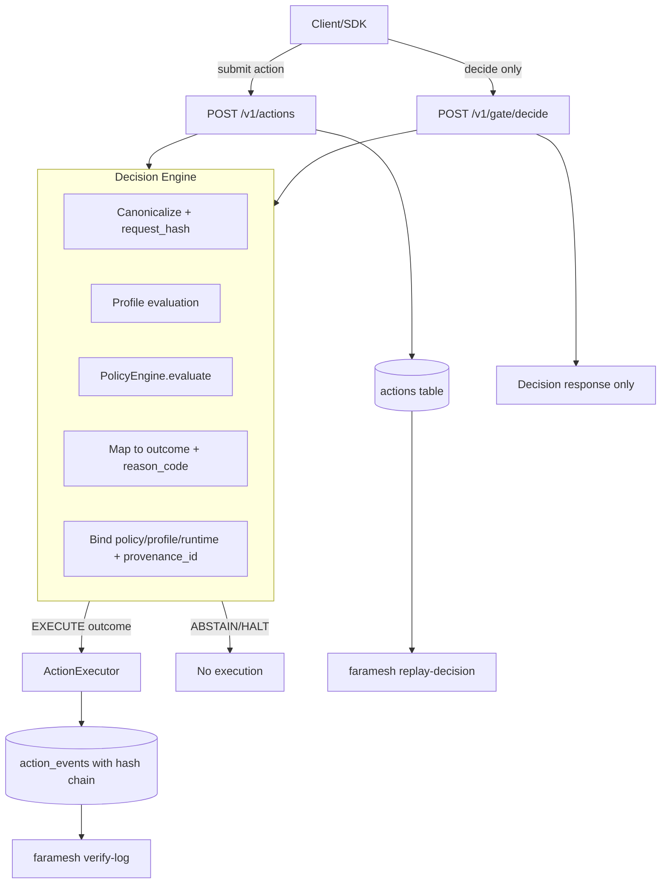

# Faramesh Architecture

This document describes the system architecture of Faramesh Core, including data flows, component interactions, and deployment patterns.

## System Overview

Faramesh is a policy-driven execution governor that sits between AI agents and their tools, evaluating every action before execution.

```
┌─────────┐      submit        ┌─────────────┐        decision        ┌───────────────┐
│ Agents  │ ─────────────────▶ │ Faramesh    │ ─────────────────────▶ │ Executors /   │
│ (LLMs,  │                    │ API Server  │                        │ Tools         │
│ Tools)  │                    │  / Policy   │                        └───────────────┘
└─────────┘                    │  Engine     │                               │
       ▲                       └─────────────┘                               │ report
       │                              ▲                                      │ result
       │                              │                                      ▼
       │                        ┌─────────────┐                       ┌──────────────┐
       │                        │ Web UI &   │◀──────────────────────▶│ Storage /    │
       └──────────────────────▶ │ CLI (HITL) │        events / state   │ DB / Metrics │
                                └─────────────┘                       └──────────────┘
```

---

## Execution Gate Flow

The deterministic execution gate ensures all actions pass through canonicalization, profile evaluation, and policy evaluation before any execution occurs.



### Decision Outcomes

| Outcome | Description | Next Step |
|---------|-------------|-----------|
| **EXECUTE** | Action is allowed to proceed | Executor runs the action |
| **ABSTAIN** | Action requires human approval | Wait for approval |
| **HALT** | Action is denied | No execution, logged |

### Version-Bound Fields

Every decision includes deterministic, version-bound metadata:
- `request_hash` - SHA-256 of canonicalized payload
- `policy_hash` - SHA-256 of policy configuration
- `profile_hash` - SHA-256 of execution profile
- `runtime_version` - Faramesh version string
- `provenance_id` - Combined hash for replay verification

---

## Core Components

### 1. API Server (`src/faramesh/server/main.py`)

FastAPI-based REST API server that:
- Receives action submissions
- Validates inputs
- Evaluates policies
- Manages approval workflows
- Serves the web UI
- Exposes metrics

**Key Endpoints:**
- `POST /v1/actions` - Submit action
- `GET /v1/actions` - List actions
- `POST /v1/actions/{id}/approval` - Approve/deny
- `GET /v1/events` - SSE stream
- `GET /metrics` - Prometheus metrics

### 2. Policy Engine (`src/faramesh/server/policy_engine.py`)

YAML-based policy evaluation engine:
- Loads policies from YAML files
- Evaluates rules in order (first-match-wins)
- Computes risk scores
- Returns decisions (allow/deny/require_approval)

**Evaluation Flow:**
```
Action → Policy Rules → First Match → Decision
                ↓
         Risk Rules → Risk Level
                ↓
         Auto-Upgrade (if high risk)
```

### 3. Storage Layer (`src/faramesh/server/storage.py`)

Abstract storage interface supporting:
- **SQLite** (default, for development)
- **PostgreSQL** (recommended for production)

**Stores:**
- Actions (all metadata)
- Events (complete timeline)
- Audit logs

### 4. Executor (`src/faramesh/server/executor.py`)

Manages action execution lifecycle:
- Starts execution
- Tracks status
- Reports results
- Handles errors

### 5. Event Manager (`src/faramesh/server/events.py`)

Event system for:
- Action state changes
- Approval decisions
- Execution results
- SSE streaming

---

## Data Flow

### 1. Action Submission Flow

```
Agent → SDK → API Server → Policy Engine → Storage
                              ↓
                         Decision Made
                              ↓
                    ┌─────────┴─────────┐
                    │                   │
              Allowed              Pending/Denied
                    │                   │
                    ▼                   ▼
              Execute            Wait for Approval
```

**Detailed Steps:**

1. **Agent submits action** via SDK or API
2. **API Server validates** input (security guardrails)
3. **Policy Engine evaluates** against YAML policy
4. **Risk scoring** computes risk level
5. **Decision made**: allow, deny, or require_approval
6. **Action stored** in database
7. **Event emitted** (created, decision_made)
8. **Response returned** to agent

### 2. Approval Workflow

```
Pending Action → Human Review → Approve/Deny → Execution/Rejection
     │              │                │
     │              │                │
     ▼              ▼                ▼
  UI/CLI        Decision         Event Logged
```

**Detailed Steps:**

1. **Action in `pending_approval` status**
2. **Human reviews** in UI or CLI
3. **Approval decision** made (approve/deny)
4. **Event emitted** (approved/denied)
5. **If approved**: Action can be executed
6. **If denied**: Action is blocked

### 3. Execution Flow

```
Approved Action → Start Execution → Execute Tool → Report Result
       │                │                │              │
       │                │                │              │
       ▼                ▼                ▼              ▼
   Status:          Status:          Status:      Status:
   approved      →   executing    →   succeeded   →  final
```

**Detailed Steps:**

1. **Agent calls** `POST /v1/actions/{id}/start`
2. **Status updated** to `executing`
3. **Tool executed** by agent/executor
4. **Result reported** via `POST /v1/actions/{id}/result`
5. **Status updated** to `succeeded` or `failed`
6. **Event emitted** (started, succeeded/failed)

---

## Component Architecture

### Policy Evaluation Layer

```
┌─────────────┐
│ YAML Policy │
│   File      │
└─────────────┘
      │
      ▼
┌─────────────┐
│ Load Policy │
│  (cached)   │
└─────────────┘
      │
      ▼
┌─────────────┐
│ Rule Match  │
│(first wins) │
└─────────────┘
      │
      ▼
┌─────────────┐
│  Decision   │
│allow/deny/  │
│  pending    │
└─────────────┘
      │
      ▼
┌─────────────┐
│ Risk Score  │
│(independent)│
└─────────────┘
      │
      ▼
┌─────────────┐
│ Auto-Upgrade│
│(high risk)  │
└─────────────┘
```

### Security Layer

```
┌─────────────┐
│   Input     │
│  (Action)   │
└─────────────┘
      │
      ▼
┌─────────────┐
│  Validate   │
│   Strings   │
│  (length,   │
│   nulls)    │
└─────────────┘
      │
      ▼
┌─────────────┐
│  Validate   │
│  Params     │
│  (size,     │
│   depth)    │
└─────────────┘
      │
      ▼
┌─────────────┐
│  Sanitize   │
│  Commands   │
│  (shell)    │
└─────────────┘
      │
      ▼
┌─────────────┐
│  Enforce    │
│ No Side     │
│  Effects    │
└─────────────┘
```

---

## Integration Architecture

### SDK Integration

```
┌─────────────┐
│   Agent     │
│  Code       │
└─────────────┘
      │
      ▼
┌─────────────┐
│  SDK        │
│ (Python/    │
│  Node.js)   │
└─────────────┘
      │
      ▼
┌─────────────┐
│  REST API   │
│  (HTTP)     │
└─────────────┘
      │
      ▼
┌─────────────┐
│  Faramesh   │
│   Server    │
└─────────────┘
```

### Framework Integration

```
┌─────────────┐
│  Framework  │
│  (LangChain,│
│   CrewAI)   │
└─────────────┘
      │
      ▼
┌─────────────┐
│  Governed   │
│   Tool      │
│  Wrapper    │
└─────────────┘
      │
      ▼
┌─────────────┐
│  Faramesh   │
│    SDK      │
└─────────────┘
      │
      ▼
┌─────────────┐
│  REST API   │
└─────────────┘
```

---

## Deployment Architectures

### 1. Local Development

```
┌─────────────────────┐
│  Developer Machine   │
│                      │
│  ┌────────────────┐ │
│  │  Faramesh      │ │
│  │  (single proc) │ │
│  │  + SQLite      │ │
│  └────────────────┘ │
│                      │
│  ┌────────────────┐ │
│  │  Agent Code    │ │
│  └────────────────┘ │
└─────────────────────┘
```

### 2. Docker Compose

```
┌──────────────────┐     ┌──────────────┐
│  Faramesh        │     │  PostgreSQL │
│  Container       │◀───▶│  Container   │
│  Port: 8000      │     │  (optional)  │
└──────────────────┘     └──────────────┘
         │
         ▼
┌──────────────────┐
│  Demo Agent      │
│  Container       │
└──────────────────┘
```

### 3. Kubernetes

```
┌──────────────────┐
│  Ingress         │
│  (Load Balancer) │
└──────────────────┘
         │
         ▼
┌──────────────────┐
│  Faramesh        │
│  Deployment      │
│  (Replicas)      │
└──────────────────┘
         │
         ▼
┌──────────────────┐
│  PostgreSQL      │
│  StatefulSet     │
│  (Persistent)    │
└──────────────────┘
```

### 4. Production (Recommended)

```
┌──────────────────┐
│  Reverse Proxy   │
│  (nginx/Traefik) │
└──────────────────┘
         │
         ▼
┌──────────────────┐     ┌──────────────┐
│  Faramesh        │◀───▶│  PostgreSQL  │
│  (Multiple       │     │  (Primary +  │
│   Instances)     │     │   Replica)   │
└──────────────────┘     └──────────────┘
         │
         ▼
┌──────────────────┐
│  Prometheus      │
│  (Metrics)       │
└──────────────────┘
```

---

## State Management

### Action State Machine

```
created
   │
   ▼
decision_made (allow/deny/require_approval)
   │
   ├──► denied ──────────────► [FINAL]
   │
   ├──► allowed ──► executing ──► succeeded ──► [FINAL]
   │                              │
   │                              └──► failed ──► [FINAL]
   │
   └──► pending_approval ──► approved ──► executing ──► succeeded ──► [FINAL]
                              │                              │
                              └──► denied ──► [FINAL]        └──► failed ──► [FINAL]
```

**State Transitions:**
- `created` → `decision_made` (automatic)
- `decision_made` → `allowed` / `denied` / `pending_approval` (policy)
- `pending_approval` → `approved` / `denied` (human)
- `allowed` / `approved` → `executing` (agent calls start)
- `executing` → `succeeded` / `failed` (agent reports result)

---

## Concurrency Model

### Optimistic Locking

Faramesh uses optimistic locking to prevent race conditions:

```
Action (version=1)
   │
   ├─ Thread 1: Read (version=1)
   │            Update (version=1→2) ✓
   │
   └─ Thread 2: Read (version=1)
                Update (version=1→2) ✗ (409 Conflict)
```

**Implementation:**
- Each action has a `version` field
- Updates check current version
- Version increments on update
- Conflicts return 409 Conflict

---

## Security Architecture

### Defense in Depth

```
Layer 1: Input Validation
  ├─ String validation (length, null bytes)
  ├─ Parameter validation (size, depth)
  └─ Context validation

Layer 2: Command Sanitization
  ├─ Shell command sanitization
  └─ Pattern detection

Layer 3: Policy Evaluation
  ├─ Deny-by-default
  ├─ First-match-wins
  └─ Risk scoring

Layer 4: Approval Workflow
  ├─ Human-in-the-loop
  ├─ Approval tokens
  └─ No side effects until approved

Layer 5: Execution Control
  ├─ Status checks
  ├─ Optimistic locking
  └─ Result reporting
```

---

## Observability

### Metrics Flow

```
┌─────────────┐
│  Faramesh   │
│   Server    │
└─────────────┘
      │
      ▼
┌─────────────┐
│  Prometheus │
│  Metrics    │
│  Endpoint   │
└─────────────┘
      │
      ▼
┌─────────────┐
│  Prometheus │
│  Server     │
└─────────────┘
      │
      ▼
┌─────────────┐
│  Grafana    │
│  Dashboard  │
└─────────────┘
```

**Metrics:**
- Request counts (by endpoint, method, status)
- Error counts (by type)
- Action counts (by status, tool)
- Action duration (histogram)

---

## Data Models

### Action Model

```python
{
    "id": "uuid",
    "agent_id": "string",
    "tool": "string",
    "operation": "string",
    "params": {},
    "context": {},
    "status": "allowed | pending_approval | denied | executing | succeeded | failed",
    "decision": "allow | deny | require_approval",
    "reason": "string",
    "risk_level": "low | medium | high",
    "approval_token": "string",
    "policy_version": "string",
    "version": 1,  # For optimistic locking
    "created_at": "ISO-8601",
    "updated_at": "ISO-8601"
}
```

### Event Model

```python
{
    "id": "uuid",
    "action_id": "uuid",
    "event_type": "created | decision_made | approved | denied | started | succeeded | failed",
    "meta": {},
    "created_at": "ISO-8601"
}
```

---

## Technology Stack

### Backend

- **FastAPI**: Web framework
- **Pydantic**: Data validation
- **SQLAlchemy**: Database ORM (via storage abstraction)
- **Alembic**: Database migrations
- **PyYAML**: Policy parsing
- **Prometheus Client**: Metrics

### Frontend

- **React 18**: UI framework
- **TypeScript**: Type safety
- **Tailwind CSS**: Styling
- **Server-Sent Events**: Real-time updates

### Storage

- **SQLite**: Default database
- **PostgreSQL**: Production database

### CLI

- **argparse**: Command parsing
- **rich**: Enhanced output (optional)
- **tabulate**: Table formatting (optional)
- **watchdog**: File watching (optional)

---

## Scalability Considerations

### Horizontal Scaling

Faramesh can be scaled horizontally:

1. **Stateless API**: API server is stateless (except for in-memory policy cache)
2. **Shared Database**: All instances share the same database
3. **Load Balancer**: Use a load balancer to distribute requests
4. **Policy Cache**: Each instance caches policy (hot reload syncs via file system)

### Performance Optimizations

1. **Policy Caching**: Policies are cached in memory
2. **Database Indexing**: Actions indexed by status, tool, agent_id
3. **Connection Pooling**: Database connection pooling
4. **Async Operations**: FastAPI async endpoints

### Limitations

1. **Policy Hot Reload**: Only works with shared file system (not suitable for distributed deployments)
2. **In-Memory Cache**: Policy cache is per-instance (not shared)
3. **SSE Connections**: Each SSE connection is per-instance

---

## See Also

- [API Reference](docs/API.md) - REST API endpoints
- [Policy Configuration](docs/POLICIES.md) - Policy engine details
- [Security Guardrails](docs/SECURITY-GUARDRAILS.md) - Security mechanisms
- [Docker Deployment](docs/DOCKER.md) - Deployment guide
- [Roadmap](ROADMAP.md) - Product roadmap
