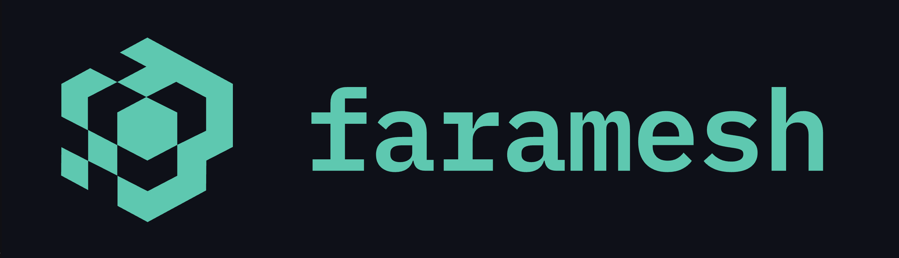

<div align="center">



**Every agent tool call is a policy decision.**

Declare permissions in `governance.fms`. A local daemon permits, defers, or denies each tool call before it runs. Decisions are hash-chained in a WAL. No SDK lock-in. No cloud required.

<p>
  <a href="LICENSE"></a>
  <a href="https://github.com/faramesh/faramesh-core/stargazers"></a>
  <a href="https://github.com/faramesh/faramesh-core/releases"></a>
  <a href="https://github.com/faramesh/faramesh-core/actions"></a>
  <a href="https://docs.faramesh.dev/"></a>
</p>

<p>
  <a href="https://farameshlabs.slack.com/ssb/redirect"></a>
  <a href="https://docs.faramesh.dev/quickstart/"></a>
</p>


</div>

---

## Install

```bash
curl -fsSL https://install.faramesh.dev/install.sh | bash
faramesh version
```

Also Homebrew, npx, Go install, or build from git. [All install paths →](https://docs.faramesh.dev/quickstart#install-the-cli)

## Works with the agent stack you already have

LangGraph · LangChain · CrewAI · OpenAI Agents · Claude Agents SDK · Claude Code · Cursor · MCP · AutoGen · AG2 · LlamaIndex · Pydantic AI · Bedrock · Semantic Kernel

13 frameworks today. SDK shim, MCP proxy, HTTP proxy, or A2A. Pick the tier that matches the agent. [Framework guides →](https://docs.faramesh.dev/frameworks/)

## What you get

- **Deterministic decisions.** Pure functions over policy and the action payload. No LLM in the decision path.
- **Non-bypassable enforcement.** Local daemon. Every tool call goes through it. No SDK to forget to wrap.
- **Identity-bound.** SPIFFE SVIDs, OIDC, or cloud workload identity. Credentials brokered at the call site.
- **Tamper-evident audit.** Decision Provenance Records, hash-chained WAL, optional KMS signing.

## A policy

```
agent "support-bot" {
  default deny

  rules {
    permit crm/customers/read
    permit crm/tickets/create
    permit email/send             if domain == "@yourcompany.com"
    defer  email/send             if domain != "@yourcompany.com"
    defer  billing/cancel_subscription
    deny   billing/delete_account
  }

  rate_limit "email/send": 50 per hour

  budget daily {
    max       $20
    on_exceed defer
  }
}
```

External emails go to a human. Cancellations require a click. Deletion is impossible without editing the policy. Daily spend ceiling. Every decision lands in a verifiable log.

[More policy patterns →](https://docs.faramesh.dev/use-cases/) · [FPL reference →](https://docs.faramesh.dev/fpl/)

## How Faramesh compares

Faramesh is the local enforcement daemon for tool-call decisions. It's narrower than full-stack agent platforms (Microsoft AGT) and operates outside the model output evaluation layer (Galileo Agent Control). [Detailed comparison →](https://docs.faramesh.dev/compare/alternatives/)

## Documentation

**Start here** · [Why Faramesh](https://docs.faramesh.dev/introduction/) · [Quickstart](https://docs.faramesh.dev/quickstart/) · [Write your first policy](https://docs.faramesh.dev/guides/your-first-policy/)

**Concepts** · [How it works](https://docs.faramesh.dev/concepts/how-it-works/) · [Interception](https://docs.faramesh.dev/concepts/interception/) · [Enforcement](https://docs.faramesh.dev/concepts/enforcement/) · [Auditing](https://docs.faramesh.dev/concepts/auditing/)

**Reference** · [FPL](https://docs.faramesh.dev/fpl/) · [Stack file](https://docs.faramesh.dev/stack/) · [CLI](https://docs.faramesh.dev/cli/) · [Python SDK](https://docs.faramesh.dev/sdks/python/) · [TypeScript SDK](https://docs.faramesh.dev/sdks/typescript/)

## Community

[Slack](https://farameshlabs.slack.com/ssb/redirect) for daily conversation. [GitHub Discussions](https://github.com/faramesh/faramesh-core/discussions) for design proposals. [Contributing guide](https://docs.faramesh.dev/guides/contributing/) for the policy pack registry and framework adapters.

## Star this repo if you ship AI agents to production

It helps other engineers find Faramesh.

## License

[MPL-2.0](LICENSE).

## Built by

Amjad Fatmi and Brian Hall at [Faramesh Labs](https://faramesh.dev).
