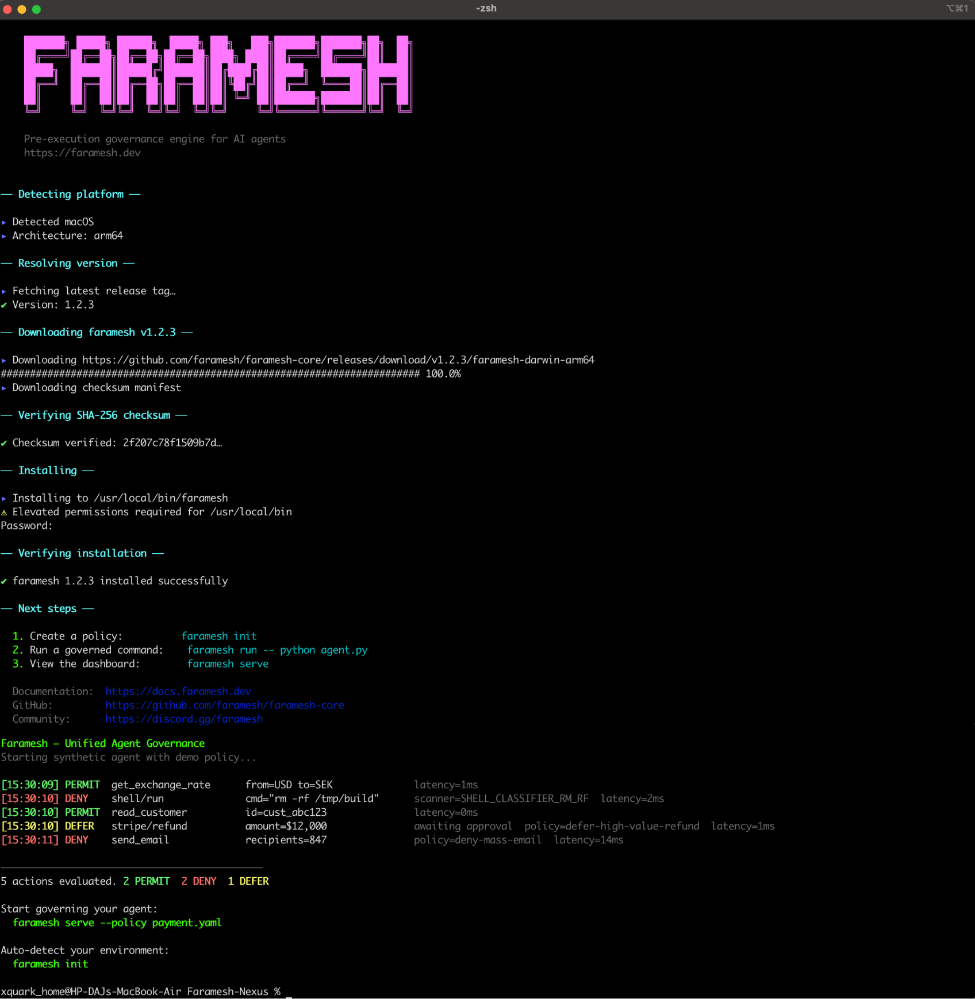
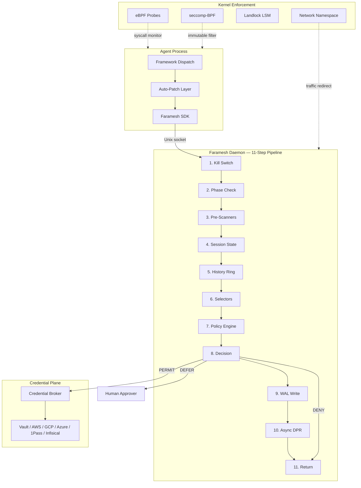

<p align="center">
  
</p>

<p align="center">
  <strong>Pre-execution governance engine for AI agents.</strong><br />
  One binary. Real governance workflow. Every framework.
</p>

<p align="center">
  <a href="LICENSE"></a>
  <a href="https://github.com/faramesh/faramesh-core/releases"></a>
  <a href="https://goreportcard.com/report/github.com/faramesh/faramesh-core"></a>
  <a href="https://github.com/faramesh/faramesh-core"></a>
</p>

<p align="center">
  <a href="https://github.com/faramesh/faramesh-core/actions/workflows/ci.yml"></a>
  <a href="https://github.com/faramesh/faramesh-core/actions/workflows/release-gate.yml"></a>
  <a href="https://github.com/faramesh/faramesh-core/actions/workflows/release.yml"></a>
  <a href="https://github.com/faramesh/faramesh-core/blob/main/cmd/faramesh/main.go"></a>
</p>

# Faramesh: AI Governance and AI Agent Execution Control

Faramesh is a deterministic AI governance engine for AI agents and tool-calling systems.
It enforces execution control before actions run, adds human approval when needed, and writes
tamper-evident decision evidence for audit and compliance.

<p align="center">
  
</p>

<p align="center">
  <sub>Governance demo view: policy, enforcement, and runtime workflow at a glance.</sub>
</p>

<p align="center">
  <a href="#install"></a>
  <a href="#quick-start"></a>
  <a href="#fpl--faramesh-policy-language"></a>
  <a href="#supported-frameworks"></a>
  <a href="#architecture"></a>
</p>

<details>
<summary><strong>Contents</strong></summary>

- [Faramesh: AI Governance and AI Agent Execution Control](#faramesh-ai-governance-and-ai-agent-execution-control)
- [What is Faramesh?](#what-is-faramesh)
- [Install](#install)
- [Setup Lifecycle (Source Checkout)](#setup-lifecycle-source-checkout)
- [Quick Start](#quick-start)
- [FPL - Faramesh Policy Language](#fpl--faramesh-policy-language)
- [Supported Frameworks](#supported-frameworks)
- [Use Cases](#use-cases)
- [Governing Real Runtimes](#governing-real-runtimes)
- [Credential Broker](#credential-broker)
- [Workload Identity (SPIFFE/SPIRE)](#workload-identity-spiffespire)
- [Observability Integrations](#observability-integrations)
- [Latency Benchmarks](#latency-benchmarks)
- [Cross-Platform Enforcement](#cross-platform-enforcement)
- [Policy Packs](#policy-packs)
- [Corpus Contracts and CI Gates](#corpus-contracts-and-ci-gates)
- [Repository Map](#repository-map)
- [CLI Reference](#cli-reference)
- [Architecture](#architecture)
- [SDKs](#sdks)
- [Documentation](#documentation)
- [Community](#community)
- [Contributing](#contributing)
- [License](#license)

</details>

---

## What is Faramesh?

Faramesh sits between your AI agent and the tools it calls. Every tool call is checked against your policy before it runs. If the policy says no, the action is blocked. If the policy says wait, a human decides. Every decision is logged to a tamper-evident chain.

Most "AI governance" tools add a second AI to watch the first. That's probability watching probability. Faramesh uses deterministic rules — code that evaluates the same way every time. No model in the middle. No guessing.

## Install

```bash
# Homebrew
brew install faramesh/tap/faramesh

# Local installer script from repository checkout
./install.sh

# Go toolchain
go install github.com/faramesh/faramesh-core/cmd/faramesh@latest

# npm package
npx @faramesh/cli@latest setup flow

# Released from GitHub Actions via npm trusted publishing (OIDC); no long-lived npm publish token is needed.

# Source checkout (single setup entrypoint)
make setup
```

## Setup Lifecycle (Source Checkout)

For local repositories and existing agent stacks (LangChain, LangGraph, DeepAgents, MCP), start from the guided product flow:

```bash
# Canonical setup command (guided first-run wizard)
faramesh wizard first-run
```

Key lifecycle commands:

```bash
# Guided first-run setup
faramesh wizard first-run

# Runtime controls
faramesh up --policy policies/default.fpl
faramesh run --broker -- python my_agent.py
faramesh approvals
faramesh explain <action-id>
faramesh audit tail
faramesh down

# Optional explicit credential setup
faramesh credential enable --policy policies/default.fpl

# Detach wiring from an existing project
faramesh offboard --path /path/to/agent
faramesh offboard --path /path/to/agent --apply

# Full cleanup: detach + remove local state
faramesh setup uninstall --path /path/to/agent --yes

# Binary maintenance
faramesh setup update
faramesh setup upgrade --version 0.5.0
```

## Quick Start

Start here for real usage in a new or existing agent project:

1. Discover likely tool surfaces in your codebase.

```bash
faramesh discover
```

2. Attach Faramesh in shadow mode to collect runtime inventory without blocking traffic.

```bash
faramesh attach
```

3. Check what is covered and what is still missing.

```bash
faramesh coverage
faramesh gaps
```

4. Generate a starter policy from what was observed.

```bash
faramesh suggest --out suggested-policy.yaml
```

5. Run your actual agent under governance enforcement.

```bash
faramesh run --broker -- python agent.py
```

6. Move to managed pack lifecycle once baseline governance looks clean.

```bash
faramesh pack search
faramesh pack install <pack-ref> --mode shadow
faramesh pack status <pack-ref>
faramesh pack enforce <pack-ref>
```

```
Faramesh Enforcement Report
  Runtime:     local
  Framework:   langchain

  ✓ Framework auto-patch (FARAMESH_AUTOLOAD)
  ✓ Credential broker (stripped: OPENAI_API_KEY, STRIPE_API_KEY)
  ✓ Network interception (proxy env vars)

  Trust level: PARTIAL
```

Watch live decisions:

```bash
faramesh audit tail
```

```
[10:00:15] PERMIT  get_exchange_rate      from=USD to=SEK              latency=11ms
[10:00:17] DENY    shell/run              cmd="rm -rf /"               policy=deny!
[10:00:18] PERMIT  read_customer          id=cust_abc123               latency=9ms
[10:00:20] DEFER   stripe/refund          amount=$12,000               awaiting approval
[10:00:21] DENY    send_email             recipients=847               policy=deny-mass-email
```

## FPL — Faramesh Policy Language

**FPL is the standard policy language for Faramesh.** Every policy starts as FPL. It is a domain-specific language purpose-built for AI agent governance — shorter than YAML, safer than Rego, readable by anyone.

```fpl
agent payment-bot {
  default deny
  model "gpt-4o"
  framework "langgraph"

  budget session {
    max $500
    daily $2000
    max_calls 100
    on_exceed deny
  }

  phase intake {
    permit read_customer
    permit get_order
  }

  rules {
    deny! shell/* reason: "never shell"
    defer stripe/refund when amount > 500
      notify: "finance"
      reason: "high value refund"
    permit stripe/* when amount <= 500
  }

  credential stripe {
    backend vault
    path secret/data/stripe/live
    ttl 15m
  }
}
```

### Why FPL?

| | FPL | YAML + expr | OPA / Rego | Cedar |
|---|---|---|---|---|
| Agent-native primitives | Yes — sessions, budgets, phases, delegation, ambient | Convention-based | No | No |
| Mandatory deny (`deny!`) | Compile-time enforced | Documentation convention | Runtime only | Runtime only |
| Lines for above policy | 25 | 65+ | 80+ | 50+ |
| Natural language compilation | Yes | No | No | No |
| Backtest before activation | Built-in | Manual | Manual | No |

### Multiple input modes, one engine

FPL is the canonical format. You can also write policies as:

- **Natural language** — `faramesh policy compile "deny all shell commands, defer refunds over $500 to finance"` compiles to FPL, validates it, and backtests it against real history before activation.
- **YAML** — always supported as an interchange format. `faramesh policy compile policy.yaml --to fpl` converts to FPL. Both formats compile to the same internal representation.
- **Code annotations** — `@faramesh.tool(defer_above=500)` in your source code is extracted to FPL automatically.

### `deny!` — mandatory deny

`deny!` is a compile-time constraint. It cannot be overridden by position, by a child policy in an `extends` chain, by priority, or by any subsequent `permit` rule. OPA, Cedar, and YAML-based engines express this as a documentation convention. FPL enforces it structurally.

## Supported Frameworks

All 13 frameworks are auto-patched at runtime — zero code changes required.

| Framework | Patch Point |
|-----------|-------------|
| LangGraph / LangChain | `BaseTool.run()` |
| CrewAI | `BaseTool._run()` |
| AutoGen / AG2 | `ConversableAgent._execute_tool_call()` |
| Pydantic AI | `Tool.run()` + `Agent._call_tool()` |
| Google ADK | `FunctionTool.call()` |
| LlamaIndex | `FunctionTool.call()` / `BaseTool.call()` |
| AWS Strands Agents | `Agent._run_tool()` |
| OpenAI Agents SDK | `FunctionTool.on_invoke_tool()` |
| Smolagents | `Tool.__call__()` |
| Haystack | `Pipeline.run()` |
| Deep Agents | LangGraph dispatch + `AgentMiddleware` |
| AWS Bedrock AgentCore | App middleware + Strands hook |
| MCP Servers (Node.js) | `tools/call` handler |

## Use Cases

- AI governance for production agent systems where every tool call must be policy-checked.
- AI agent guardrails for coding agents, customer support agents, and payment workflows.
- AI execution control for MCP tools, API actions, shell actions, and delegated sub-agents.
- Compliance-ready decision evidence with deterministic replay and tamper-evident provenance.

## Governing Real Runtimes

### OpenClaw

```bash
faramesh run --broker -- node openclaw/gateway.js
```

Faramesh patches the OpenClaw tool dispatch, strips credentials from `~/.openclaw/`, and governs every tool call through the policy engine. The agent never sees raw API keys.

### NemoClaw

```bash
faramesh run --broker --enforce full -- python -m nemoclaw.serve --config agent.yaml
```

NemoClaw runs inside Faramesh's sandbox. On Linux, the kernel sandbox (seccomp-BPF, Landlock, network namespace) prevents the agent from bypassing governance.

### Deep Agents (LangChain)

```bash
faramesh run --broker -- python -m deep_agents.main
```

Faramesh patches `BaseTool.run()` and injects `AgentMiddleware` into the LangGraph execution loop. Multi-agent delegation is tracked with cryptographic tokens — the supervisor's permissions are the ceiling for any sub-agent.

### Claude Code / Cursor

```bash
faramesh mcp wrap -- node your-mcp-server.js
```

Faramesh intercepts every MCP `tools/call` request. The IDE agent connects to Faramesh instead of the real MCP server. Non-tool-call methods pass through unchanged.

MCP docs are split by audience:

- Fast setup and daily usage: [MCP_INTERCEPTION_GOVERNANCE_PLAN.md](https://github.com/faramesh/faramesh-core/blob/main/docs/guides/MCP_INTERCEPTION_GOVERNANCE_PLAN.md)
- Full technical spec and deep hardening details: [MCP_INTERCEPTION_GOVERNANCE_SPEC.md](https://github.com/faramesh/faramesh-core/blob/main/docs/power-users/mcp/MCP_INTERCEPTION_GOVERNANCE_SPEC.md)

## Credential Broker

Faramesh strips API keys from the agent's environment. Credentials are only issued after the policy permits the specific tool call.

| Backend | Config |
|---------|--------|
| HashiCorp Vault | `--vault-addr`, `--vault-token` |
| AWS Secrets Manager | `--aws-secrets-region` |
| GCP Secret Manager | `--gcp-secrets-project` |
| Azure Key Vault | `--azure-vault-url`, `--azure-tenant-id` |
| 1Password Connect | `FARAMESH_CREDENTIAL_1PASSWORD_HOST` |
| Infisical | `FARAMESH_CREDENTIAL_INFISICAL_HOST` |

### Local Vault Provisioning + Interactive Key Intake

For hard boundary local development, Faramesh can provision a local Vault dev
instance and securely prompt for a key so it is written directly to brokered
Vault storage.

```bash
# 1) Configure global credential sequestration defaults
faramesh credential enable --policy policies/payment-bot.fpl

# 2) Start runtime with persisted credential profile
faramesh up --policy policies/payment-bot.fpl

# 3) Run agent with ambient secret stripping
faramesh run --broker --agent-id payment-bot -- python your_agent.py
```

Advanced operator path: pass explicit backend and provider mappings only when your environment needs manual routing controls.

### External Vault Integration

```bash
faramesh credential enable \
  --policy policies/payment-bot.fpl \
  --backend vault \
  --vault-addr https://vault.company.internal:8200 \
  --vault-token "$VAULT_TOKEN"
```

Use `faramesh credential status` to verify global backend/routing health and
`faramesh credential vault down` to stop locally provisioned dev Vault.

## Workload Identity (SPIFFE/SPIRE)

Faramesh can consume SPIFFE workload identity at runtime and expose identity controls in the CLI.

- `faramesh identity status` shows identity readiness (whoami, trust level, verify) in one command.
- `faramesh serve --spiffe-socket <path>` enables SPIFFE workload identity resolution from the Workload API socket.
- `faramesh identity verify --spiffe spiffe://example.org/agent` verifies workload identity state.
- `faramesh identity trust --domain example.org --bundle /path/to/bundle.pem` configures trust domain and bundle.

In a SPIRE-based deployment, CA issuance and SVID lifecycle management are handled by SPIRE/SPIFFE components. Faramesh consumes the resulting SPIFFE identity and trust data for policy decisions and credential brokering.

## Observability Integrations

Faramesh exposes Prometheus-compatible metrics on `/metrics` via `--metrics-port`. This is the integration point for common observability platforms:

- Grafana: scrape via Prometheus or Grafana Alloy, then build dashboards and alerts.
- Datadog: use OpenMetrics scraping against `/metrics` and correlate with decision/audit events.
- New Relic: ingest Prometheus/OpenMetrics data from `/metrics` for governance and runtime monitoring.

## Latency Benchmarks

Faramesh includes a reproducible benchmark target for policy-engine and full-pipeline latency:

```bash
make benchmark-latency
```

Command details used for the numbers below:

```bash
go test ./internal/core/policy -run '^$' -bench BenchmarkEngineEvaluateSimplePermit -benchmem -benchtime=2s -cpu=1 -count=5
go test ./internal/core -run '^$' -bench BenchmarkPipelineEvaluateSimplePermit -benchmem -benchtime=2s -cpu=1 -count=5
```

Measured on 2026-04-06 (darwin/arm64, Apple M1):

| Benchmark | Median Latency | Allocations |
|----------|----------------|-------------|
| `BenchmarkEngineEvaluateSimplePermit` | `68.52 ns/op` | `0 allocs/op` |
| `BenchmarkPipelineEvaluateSimplePermit` | `57,774 ns/op` (`57.774 us/op`) | `151 allocs/op` |

Observed added latency for full governance pipeline vs raw policy evaluation:

- approximately `57.705 us` per decision on median samples.

These are reference measurements for release engineering, not hard latency guarantees.

## Cross-Platform Enforcement

| Platform | Layers | Trust Level |
|----------|--------|-------------|
| **Linux + root** | seccomp-BPF + Landlock + netns + credential broker + auto-patch (eBPF LSM scaffolded, not active) | STRONG |
| **Linux** | Landlock + proxy + credential broker + auto-patch | MODERATE |
| **macOS** | Proxy env vars + PF rules + credential broker + auto-patch | PARTIAL |
| **Windows** | Proxy env vars + WinDivert + credential broker + auto-patch | PARTIAL |
| **Serverless** | Credential broker + auto-patch | CREDENTIAL_ONLY |

## Policy Packs

Faramesh ships policy packs and a full lifecycle command surface.

Core usage:

```bash
faramesh pack search
faramesh pack preview <pack-ref>
faramesh pack install <pack-ref> --mode shadow
faramesh pack status <pack-ref>
faramesh pack enforce <pack-ref>
faramesh pack diff <pack-ref>
faramesh pack upgrade <pack-ref>
```

Bundled pack families in this repository:

- Foundation packs: `faramesh-starter`, `faramesh-coding-agent`, `faramesh-payment-agent`, `faramesh-support-agent`, `faramesh-mcp-server`, `faramesh-shell-controls`, `faramesh-infra-agent`.
- P2 vertical packs: `faramesh-p2-data-agent`, `faramesh-p2-docs-writer`, `faramesh-p2-marketing-agent`, `faramesh-p2-email-outbound`, `faramesh-p2-customer-success`, `faramesh-p2-network-controls`, `faramesh-p2-ops-release`, `faramesh-p2-research-agent`, `faramesh-p2-vendor-diligence`, `faramesh-p2-webhook-agent`, `faramesh-p2-multi-agent`.

Pack artifacts are written as `policy.yaml` with optional authored `policy.fpl` and normalized `policy.compiled.yaml` where available.

### Pack authoring and validation

```bash
make packs-verify
```

This validates all on-disk pack policies and compiles bundled FPL sidecars.

## Corpus Contracts and CI Gates

Faramesh release hardening is anchored by the corpus contract + matrix workflows under `tests/corpus`.

Local commands:

```bash
make corpus-contract
make corpus-matrix
make corpus-check
make corpus-run ENTRY=tests/corpus/framework-hooks/langchain-governed-smoke
```

This keeps release gating tied to real runnable harnesses and prevents stale matrix drift.

## Repository Map

```text
faramesh-core/
├── cmd/                  # CLI entrypoints
├── internal/             # Governance engine, adapters, policy runtime
├── sdk/                  # Official SDKs (Node, Python)
├── deploy/               # Kubernetes, ECS, Nomad, systemd, Cloud Run examples
├── examples/             # Ready-to-run FPL policy examples
├── packs/                # Policy packs
└── docs/                 # Product and architecture documentation
```

## CLI Reference

See the [full CLI reference](https://faramesh.dev/docs/cli-reference) for full command documentation.

The public Faramesh help surface is tiered:

- Core commands: default product path for day-1 usage and everyday governance.
- Operator commands: powerful operational workflows for onboarding, incident response, approvals, and runtime control.
- Advanced commands: expert and multi-system workflows.
- Internal commands: engineering-only surfaces, intentionally hidden from help.

### Core Top-Level Commands (Visible)

| Command | Primary role |
|---------|--------------|
| `faramesh up` | Start the product stack (runtime + visibility + approvals UI when available) |
| `faramesh down` | Stop the product stack cleanly |
| `faramesh status` | Show daemon and runtime health |
| `faramesh run -- <cmd>` | Run an agent process under governance enforcement |
| `faramesh approvals` | List, approve, deny, and open approvals UI |
| `faramesh policy` | Validate, compile, and test policies |
| `faramesh audit` | Tail, verify, inspect, and export evidence |
| `faramesh auth` | Login/logout/status for platform auth |
| `faramesh credential` | Broker and vault credential lifecycle |
| `faramesh wizard` | Guided first-run and enterprise setup flow |

### Operator Top-Level Commands (Visible)

| Command | Primary role |
|---------|--------------|
| `faramesh start` | Start runtime-only process (operator compatibility path) |
| `faramesh stop` | Stop runtime-only process |
| `faramesh serve` | Run daemon directly with explicit runtime options |
| `faramesh setup` | Guided setup and lifecycle management |
| `faramesh onboard` | Onboarding readiness checks and bootstrap guidance |
| `faramesh offboard` | Remove Faramesh runtime wiring from projects |
| `faramesh discover` | Find likely governance surfaces in a project |
| `faramesh attach` | Attach in observe-first mode |
| `faramesh coverage` | Report static/runtime governance coverage |
| `faramesh gaps` | Report uncovered governance surfaces |
| `faramesh suggest` | Generate starter policy from observed inventory |
| `faramesh agent` | Agent control workflows (pending/history/kill/unkill) |
| `faramesh identity` | Workload and agent identity controls |
| `faramesh incident` | Incident declaration/isolation workflows |
| `faramesh provenance` | Provenance attestations and drift checks |
| `faramesh pack` | Search/install/manage policy packs |
| `faramesh mcp` | Wrap MCP servers with governance |

### Advanced Top-Level Commands (Visible)

| Command | Primary role |
|---------|--------------|
| `faramesh detect` | Detect local framework/runtime characteristics |
| `faramesh init` | Scaffold baseline Faramesh files in a project |
| `faramesh explain` | Explain a decision record in detail |
| `faramesh compliance` | Export compliance-oriented artifacts |
| `faramesh fleet` | Multi-instance fleet operations |
| `faramesh delegate` | Agent-to-agent delegation chains |
| `faramesh federation` | Cross-organization federation and trust relationships |
| `faramesh schedule` | Scheduled tool execution workflows |

### Internal Top-Level Commands (Hidden)

`chaos-test`, `compensate`, `demo`, `hub`, `model`, `ops`, `sbom`, `session`, `sign`, `verify`

Operator note: set `faramesh serve --dpr-hmac-key <secret>` from stable secret storage in production. If omitted, Faramesh generates an ephemeral DPR HMAC key per daemon run, so HMAC signatures are not stable across restarts.

## Architecture



If the WAL write fails, the decision is DENY. No execution without a durable audit record.

## SDKs

| Language | Path | Package |
|----------|------|---------|
| Python | [`sdk/python`](sdk/python) | `pip install faramesh-sdk` |
| TypeScript / Node.js | [`sdk/node`](sdk/node) | `npm install @faramesh/sdk` |

Both SDKs provide `govern()`, `GovernedTool`, policy helpers, snapshot canonicalization, and `gate()` for wrapping any tool call with pre-execution governance.

## Documentation

Full documentation at [faramesh.dev/docs](https://faramesh.dev/docs).

Repository docs for crawlers and contributors:

Quick-user docs first:

- [Guides Index (Quick Usage)](docs/guides/README.md)
- [Simple Docs Start Here](docs/simple/00_START_HERE.md)
- [All Features Quick Guide](docs/guides/FEATURES_QUICK_GUIDE.md)
- [Framework Quick Guides (LangChain / LangGraph / Deep Agents)](docs/guides/frameworks/README.md)

Power-user docs:

- [Power-User Docs Index](docs/power-users/README.md)
- [All Features Power-User Technical Reference](docs/power-users/FEATURES_TECHNICAL_REFERENCE.md)
- [Framework Power-User Technical Guides](docs/power-users/frameworks/README.md)
- [MCP Power-User Spec](docs/power-users/mcp/MCP_INTERCEPTION_GOVERNANCE_SPEC.md)

More docs and references:

- [Docs Index](docs/README.md)
- [30-Second Real Agent Guide](docs/guides/REAL_AGENT_TEST_GUIDE.md)
- [Simple Docs Track](docs/simple/README.md)
- [Network Hardening Canary Runbook](docs/guides/NETWORK_HARDENING_CANARY_RUNBOOK.md)
- [Network Hardening Progressive Enforce Runbook](docs/guides/NETWORK_HARDENING_PROGRESSIVE_ENFORCE_RUNBOOK.md)
- [MCP Quick Guide](docs/guides/MCP_INTERCEPTION_GOVERNANCE_PLAN.md)
- [MCP Power-User Spec](docs/power-users/mcp/MCP_INTERCEPTION_GOVERNANCE_SPEC.md)
- [FPL Docs in Repo](docs/fpl/README.md)
- [Deployment References](deploy/README.md)
- [FPL Getting Started](https://github.com/faramesh/fpl-lang/blob/main/docs/GETTING_STARTED.md)
- [FPL Language Reference](https://github.com/faramesh/fpl-lang/blob/main/docs/LANGUAGE_REFERENCE.md)
- [FPL Comparison](https://github.com/faramesh/fpl-lang/blob/main/docs/COMPARISON.md)

<details>
<summary><strong>Search Topics (SEO)</strong></summary>

This repository targets high-intent technical topics across agent governance and runtime control:

- AI governance
- AI agent governance
- AI agent security
- AI execution control
- Agent execution control
- Policy as code for AI agents
- Deterministic policy engine
- MCP governance and Model Context Protocol guardrails
- AI compliance and agent audit trail

</details>

## Community

<p>
  Help shape Faramesh and track what is next:
</p>

- Contribution guidelines: [CONTRIBUTING.md](CONTRIBUTING.md)
- Roadmap and milestones: [GitHub Milestones](https://github.com/faramesh/faramesh-core/milestones)
- Roadmap discussions/issues: [Roadmap-labeled issues](https://github.com/faramesh/faramesh-core/issues?q=is%3Aissue+label%3Aroadmap)

<p align="center">
  <a href="https://github.com/faramesh/faramesh-core/graphs/contributors">
    
  </a>
</p>

## Contributing

See [CONTRIBUTING.md](CONTRIBUTING.md) for development setup, coding standards, and contribution workflow.

## License

[Mozilla Public License 2.0](LICENSE)
